# Mermaid 渲染样张

> 手动渲染回归用测试文档：覆盖 rumark 支持的全部 13 种 Mermaid 图表类型，
> 每种类型提供多个变体（不同方向、语法特性、密度），全部使用中文标注。
> 用 rumark 打开本文件逐屏目检，也可与 mermaid.live 官方渲染对照。
>
> 已知不支持的官方语法（渲染时被忽略或按纯文本处理，勿加入样例）：
> 类图 `note for X "..."` 注释、 ` ` 换行、主题指令（init 只校验 JSON）、
> 流程图 fontAwesome 图标。requirement/kanban/c4/sankey/radar/block/packet/
> architecture/zenuml/treemap 等类型已被 rumark 列入不支持清单（渲染为代码块）。

## 1. 流程图（flowchart）

### 1a. 横向 + 样式定义

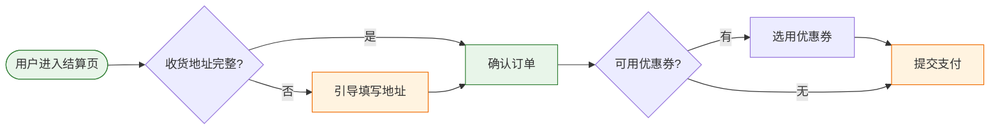
```mermaid
flowchart LR
    开始([用户进入结算页]) --> 地址{收货地址完整?}
    地址 -->|是| 确认[确认订单]
    地址 -->|否| 引导[引导填写地址] --> 确认
    确认 --> 优惠券{可用优惠券?}
    优惠券 -->|有| 选用[选用优惠券] --> 提交
    优惠券 -->|无| 提交[提交支付]
    classDef good fill:#e8f5e9,stroke:#2e7d32
    classDef warn fill:#fff3e0,stroke:#ef6c00
    class 开始,确认 good
    class 引导,提交 warn
```

### 1b. 嵌套子图 + 外部连线

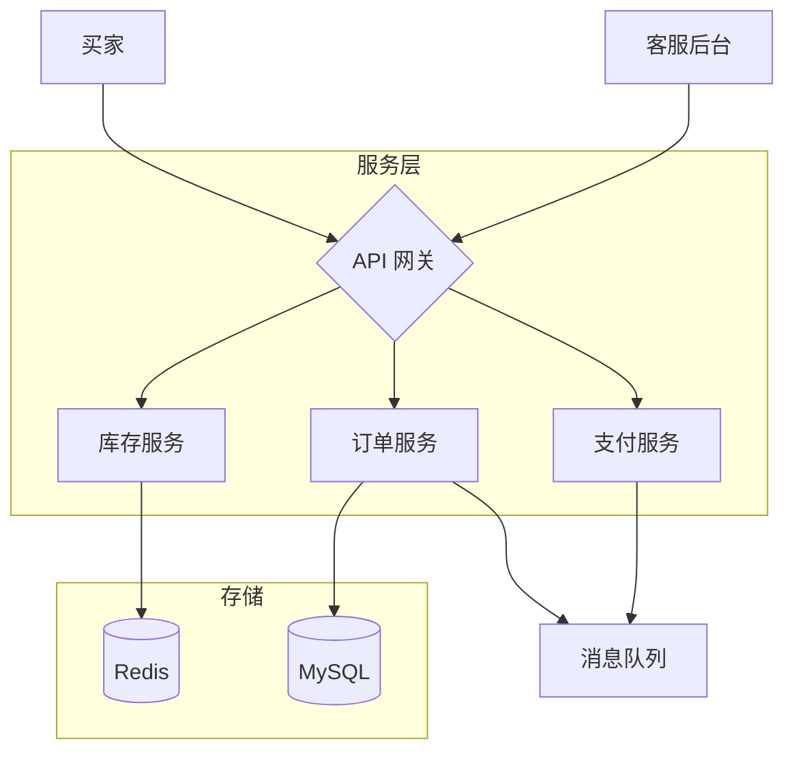
```mermaid
flowchart TB
    用户[买家] --> 网关
    客服[客服后台] --> 网关
    subgraph 服务层
        direction TB
        网关{API 网关} --> 订单[订单服务]
        网关 --> 支付[支付服务]
        网关 --> 库存[库存服务]
    end
    订单 --> 消息[消息队列]
    支付 --> 消息
    subgraph 存储
        库存 --> 缓存[(Redis)]
        订单 --> 主库[(MySQL)]
    end
```

### 1c. 虚线与加粗连线 + 环形依赖

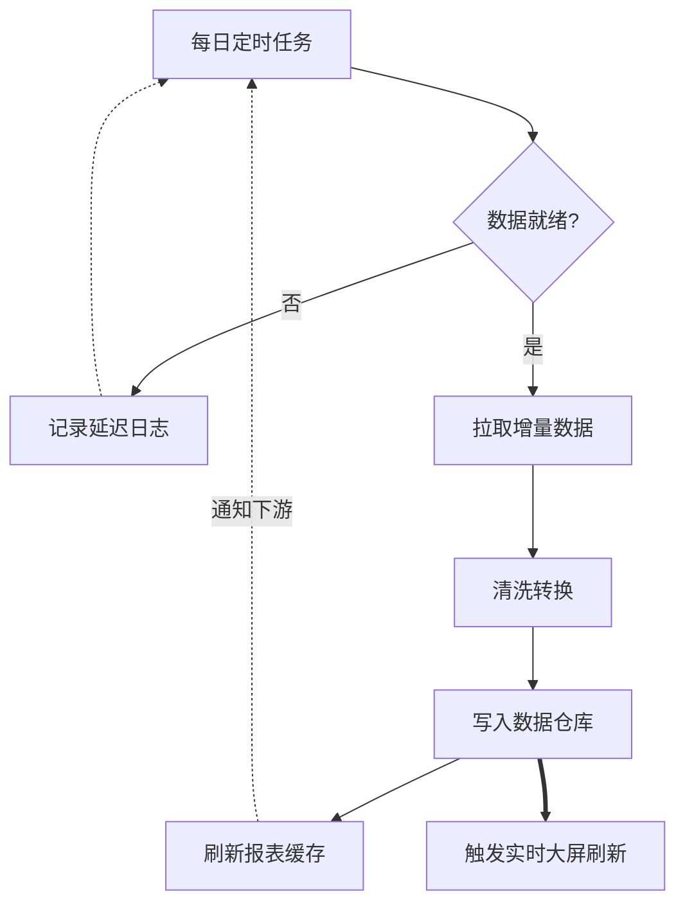
```mermaid
flowchart TD
    A[每日定时任务] --> B{数据就绪?}
    B -->|否| C[记录延迟日志] -.-> A
    B -->|是| D[拉取增量数据]
    D --> E[清洗转换]
    E --> F[写入数据仓库]
    F --> G[刷新报表缓存]
    G -.->|通知下游| A
    F ==> H[触发实时大屏刷新]
```

## 2. 时序图（sequenceDiagram）

### 2a. 自动编号 + 激活 + 分组框

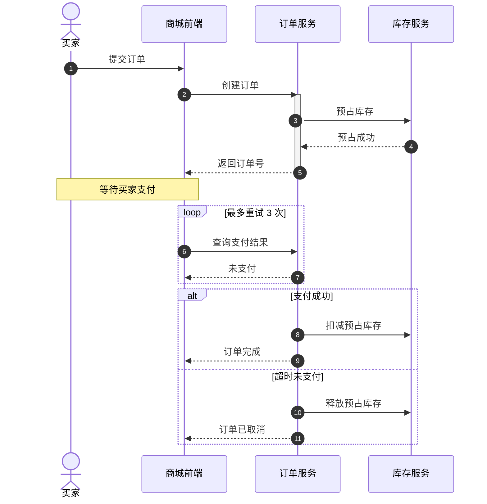
```mermaid
sequenceDiagram
    autonumber
    actor 买家
    participant 商城 as 商城前端
    participant 订单 as 订单服务
    participant 库存 as 库存服务
    买家->>商城: 提交订单
    商城->>订单: 创建订单
    activate 订单
    订单->>库存: 预占库存
    库存-->>订单: 预占成功
    订单-->>商城: 返回订单号
    deactivate 订单
    Note over 商城,买家: 等待买家支付
    loop 最多重试 3 次
        商城->>订单: 查询支付结果
        订单-->>商城: 未支付
    end
    alt 支付成功
        订单->>库存: 扣减预占库存
        订单-->>商城: 订单完成
    else 超时未支付
        订单->>库存: 释放预占库存
        订单-->>商城: 订单已取消
    end
```

### 2b. 并行分支 + 分组框

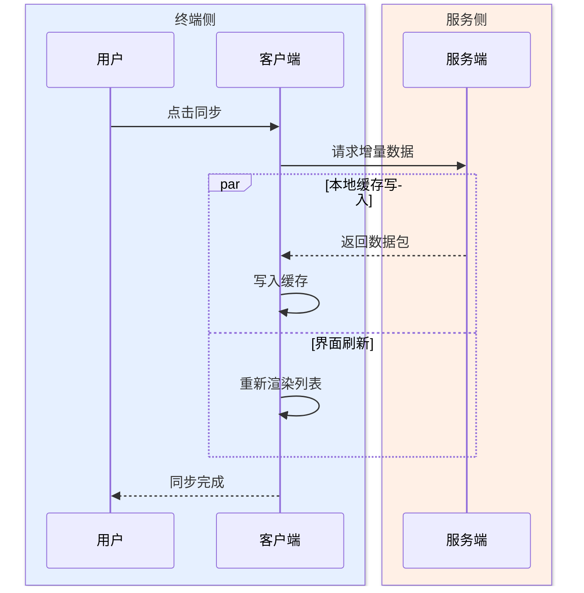
```mermaid
sequenceDiagram
    participant 用户
    participant 客户端
    participant 服务端
    box rgb(230,240,255) 终端侧
        actor 用户
        participant 客户端
    end
    box rgb(255,240,230) 服务侧
        participant 服务端
    end
    用户->>客户端: 点击同步
    客户端->>服务端: 请求增量数据
    par 本地缓存写入
        服务端-->>客户端: 返回数据包
        客户端->>客户端: 写入缓存
    and 界面刷新
        客户端->>客户端: 重新渲染列表
    end
    客户端-->>用户: 同步完成
```

### 2c. opt 与 break

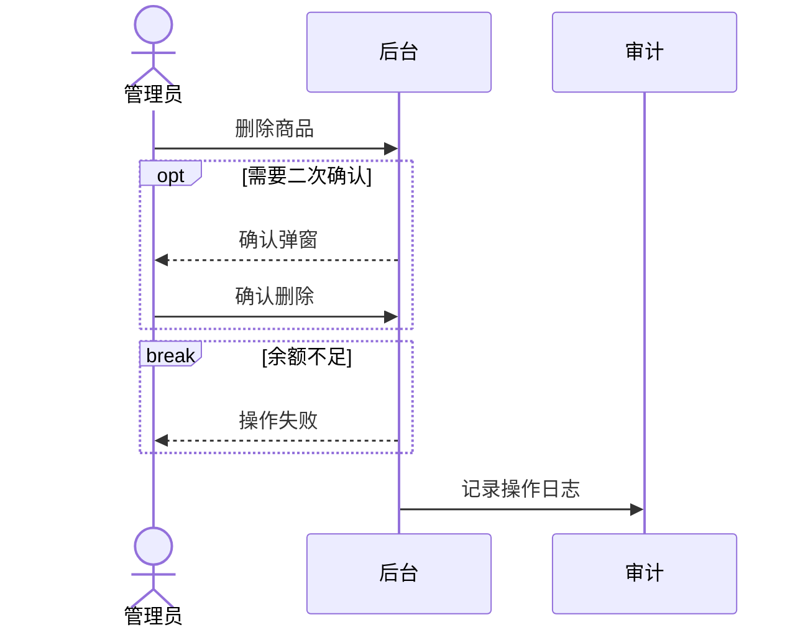
```mermaid
sequenceDiagram
    actor 管理员
    participant 后台
    participant 审计
    管理员->>后台: 删除商品
    opt 需要二次确认
        后台-->>管理员: 确认弹窗
        管理员->>后台: 确认删除
    end
    break 余额不足
        后台-->>管理员: 操作失败
    end
    后台->>审计: 记录操作日志
```

## 3. 类图（classDiagram）

### 3a. 继承与接口

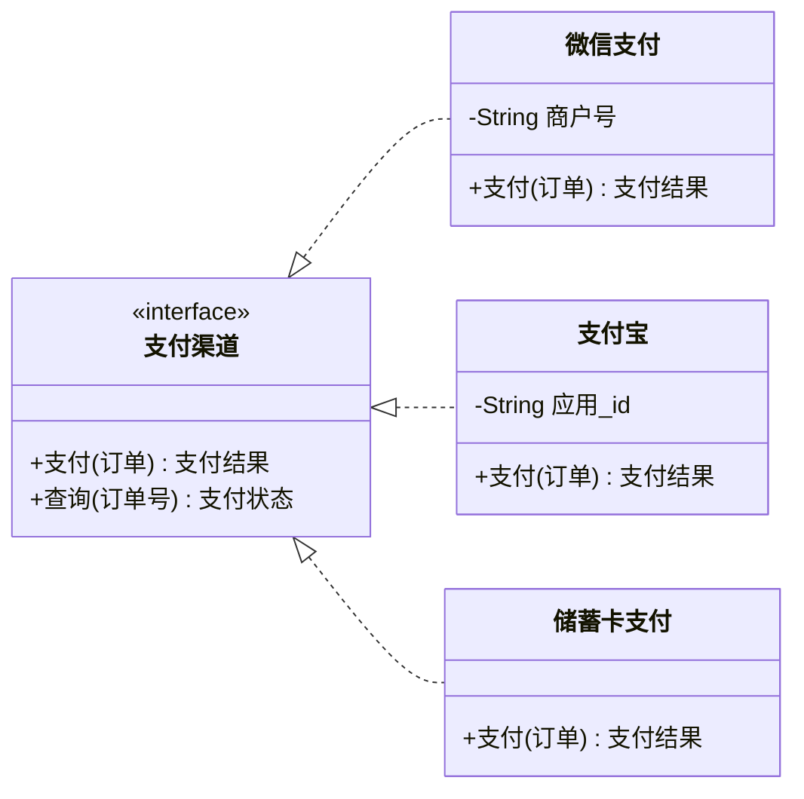
```mermaid
classDiagram
    direction LR
    class 支付渠道 {
        <<interface>>
        +支付(订单) 支付结果
        +查询(订单号) 支付状态
    }
    class 微信支付 {
        -String 商户号
        +支付(订单) 支付结果
    }
    class 支付宝 {
        -String 应用_id
        +支付(订单) 支付结果
    }
    class 储蓄卡支付 {
        +支付(订单) 支付结果
    }
    支付渠道 <|.. 微信支付
    支付渠道 <|.. 支付宝
    支付渠道 <|.. 储蓄卡支付
```

### 3b. 泛型与静态成员

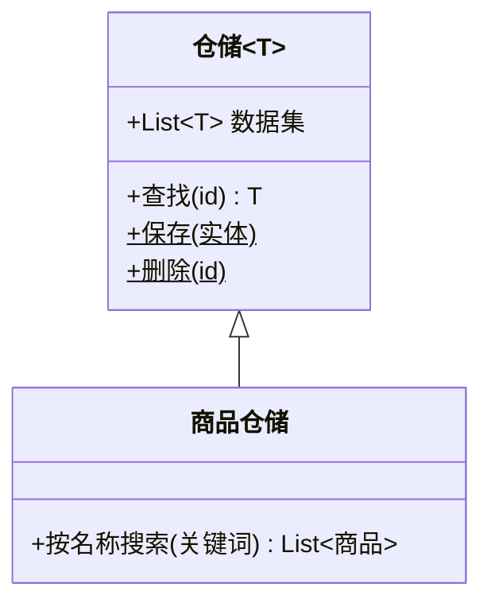
```mermaid
classDiagram
    class 仓储~T~ {
        +List~T~ 数据集
        +查找(id) T
        +保存(实体)$
        +删除(id)$
    }
    class 商品仓储 {
        +按名称搜索(关键词) List~商品~
    }
    仓储~T~ <|-- 商品仓储
```

## 4. 状态图（stateDiagram-v2）

### 4a. 分叉与会合

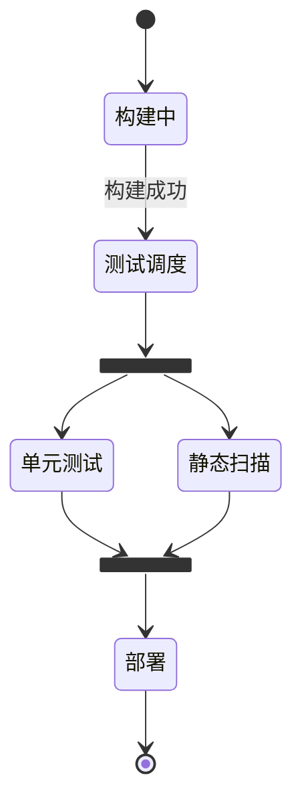
```mermaid
stateDiagram-v2
    [*] --> 构建中
    构建中 --> 测试调度 : 构建成功
    state fork_state <<fork>>
    测试调度 --> fork_state
    fork_state --> 单元测试
    fork_state --> 静态扫描
    state join_state <<join>>
    单元测试 --> join_state
    静态扫描 --> join_state
    join_state --> 部署
    部署 --> [*]
```

### 4b. 状态注释 + 深层嵌套

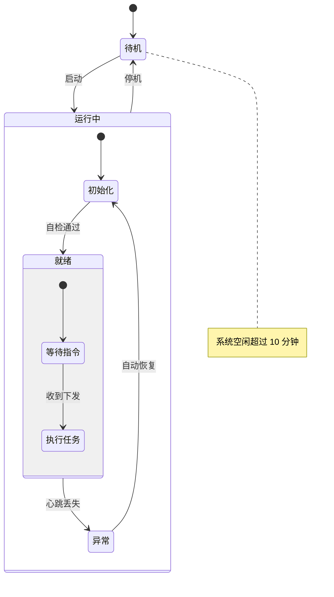
```mermaid
stateDiagram-v2
    [*] --> 待机
    待机 --> 运行中 : 启动
    note right of 待机 : 系统空闲超过 10 分钟
    state 运行中 {
        [*] --> 初始化
        初始化 --> 就绪 : 自检通过
        state 就绪 {
            [*] --> 等待指令
            等待指令 --> 执行任务 : 收到下发
        }
        就绪 --> 异常 : 心跳丢失
        异常 --> 初始化 : 自动恢复
    }
    运行中 --> 待机 : 停机
```

## 5. 实体关系图（erDiagram）

### 5a. 属性与主外键

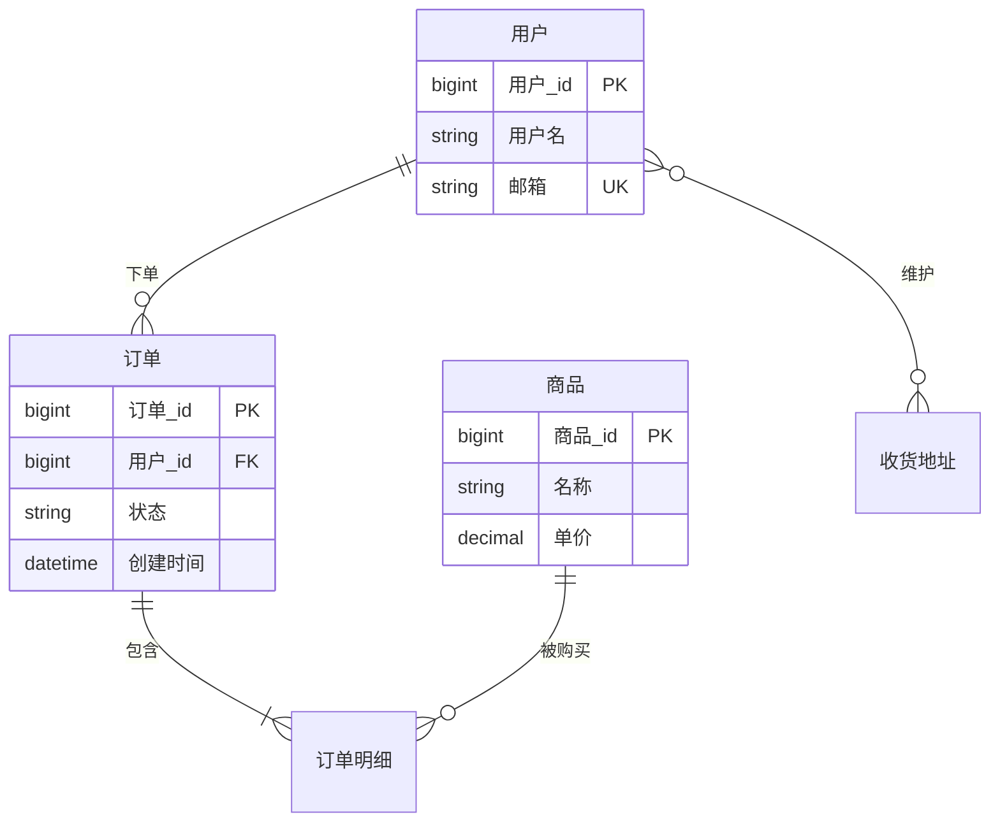
```mermaid
erDiagram
    用户 ||--o{ 订单 : 下单
    订单 ||--|{ 订单明细 : 包含
    商品 ||--o{ 订单明细 : 被购买
    用户 }o--o{ 收货地址 : 维护
    用户 {
        bigint 用户_id PK
        string 用户名
        string 邮箱 UK
    }
    订单 {
        bigint 订单_id PK
        bigint 用户_id FK
        string 状态
        datetime 创建时间
    }
    商品 {
        bigint 商品_id PK
        string 名称
        decimal 单价
    }
```

### 5b. 自引用与多对多

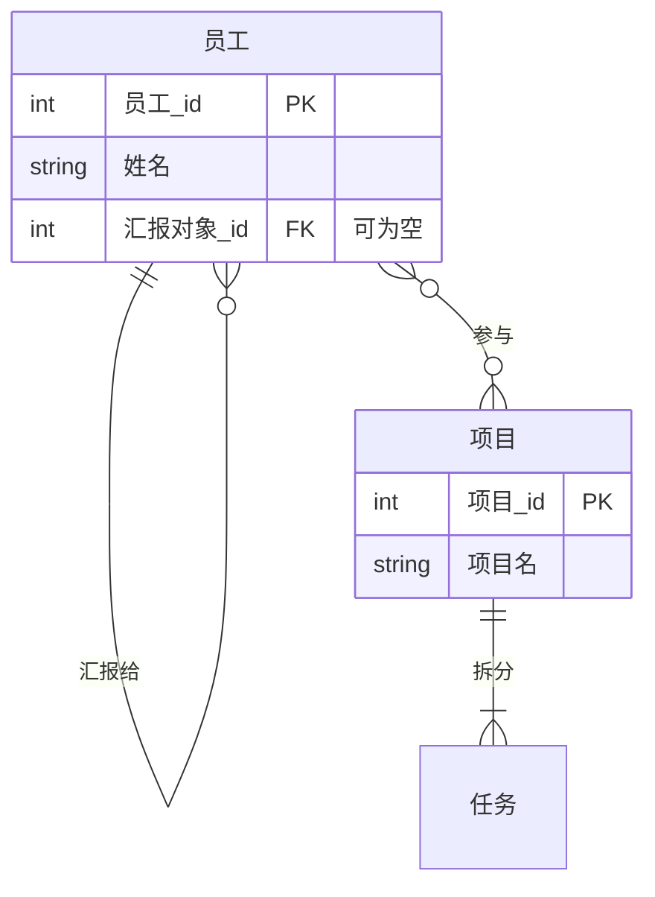
```mermaid
erDiagram
    员工 ||--o{ 员工 : 汇报给
    员工 }o--o{ 项目 : 参与
    项目 ||--|{ 任务 : 拆分
    员工 {
        int 员工_id PK
        string 姓名
        int 汇报对象_id FK "可为空"
    }
    项目 {
        int 项目_id PK
        string 项目名
    }
```

## 6. 用户旅程图（journey）

### 6a. 电商购物

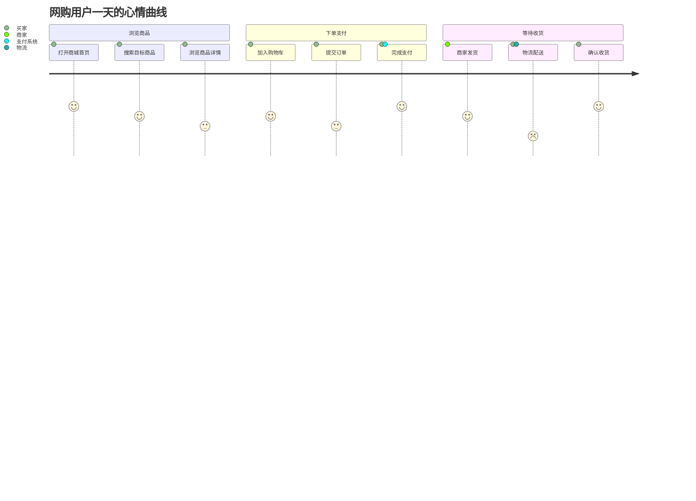
```mermaid
journey
    title 网购用户一天的心情曲线
    section 浏览商品
        打开商城首页: 5: 买家
        搜索目标商品: 4: 买家
        浏览商品详情: 3: 买家
    section 下单支付
        加入购物车: 4: 买家
        提交订单: 3: 买家
        完成支付: 5: 买家, 支付系统
    section 等待收货
        商家发货: 4: 商家
        物流配送: 2: 买家, 物流
        确认收货: 5: 买家
```

### 6b. 售后退货

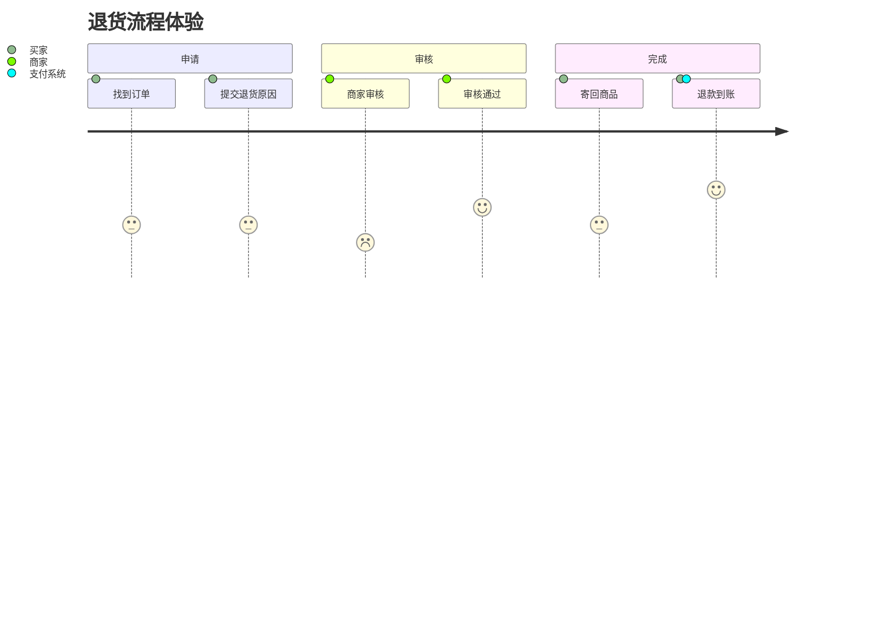
```mermaid
journey
    title 退货流程体验
    section 申请
        找到订单: 3: 买家
        提交退货原因: 3: 买家
    section 审核
        商家审核: 2: 商家
        审核通过: 4: 商家
    section 完成
        寄回商品: 3: 买家
        退款到账: 5: 买家, 支付系统
```

## 7. 甘特图（gantt）

### 7a. 大促排期

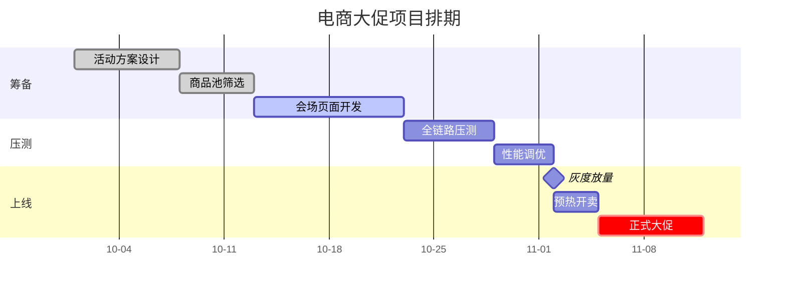
```mermaid
gantt
    title 电商大促项目排期
    dateFormat YYYY-MM-DD
    axisFormat %m-%d
    section 筹备
        活动方案设计 :done, plan1, 2026-10-01, 7d
        商品池筛选 :done, plan2, after plan1, 5d
        会场页面开发 :active, dev1, after plan2, 10d
    section 压测
        全链路压测 :stress1, after dev1, 6d
        性能调优 :stress2, after stress1, 4d
    section 上线
        灰度放量 :milestone, m1, after stress2, 0d
        预热开卖 :live1, after m1, 3d
        正式大促 :crit, live2, after live1, 7d
```

### 7b. 迭代冲刺

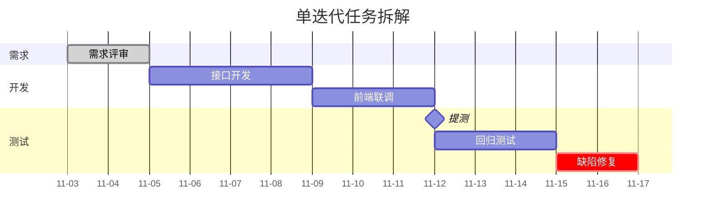
```mermaid
gantt
    title 单迭代任务拆解
    dateFormat YYYY-MM-DD
    axisFormat %m-%d
    section 需求
        需求评审 :done, r1, 2026-11-03, 2d
    section 开发
        接口开发 :d1, after r1, 4d
        前端联调 :d2, after d1, 3d
    section 测试
        提测 :milestone, t0, after d2, 0d
        回归测试 :t1, after t0, 3d
        缺陷修复 :crit, t2, after t1, 2d
```

## 8. 饼图（pie）

### 8a. 显示数值

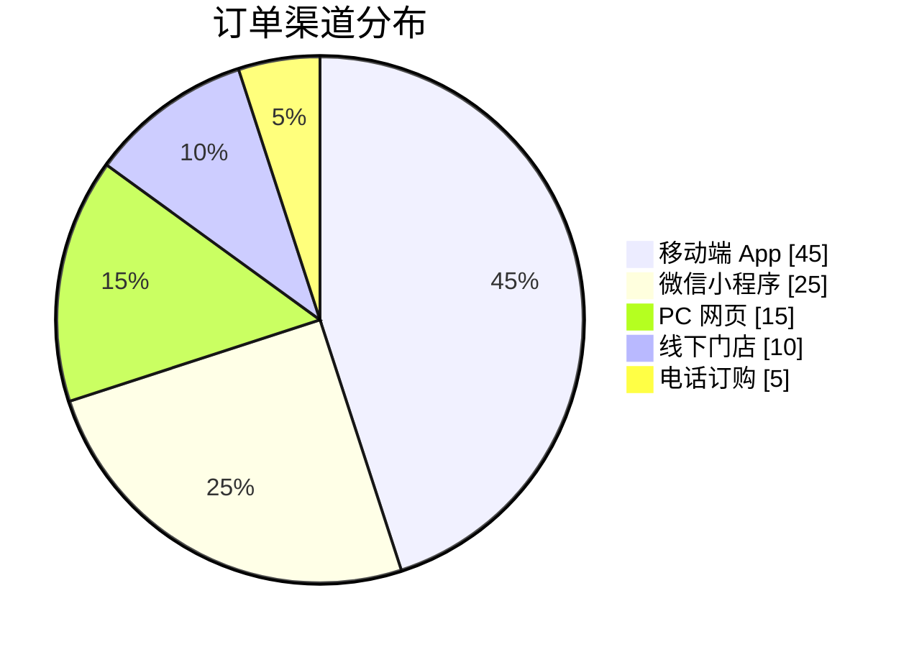
```mermaid
pie showData
    title 订单渠道分布
    "移动端 App" : 45
    "微信小程序" : 25
    "PC 网页" : 15
    "线下门店" : 10
    "电话订购" : 5
```

### 8b. 不显示数值

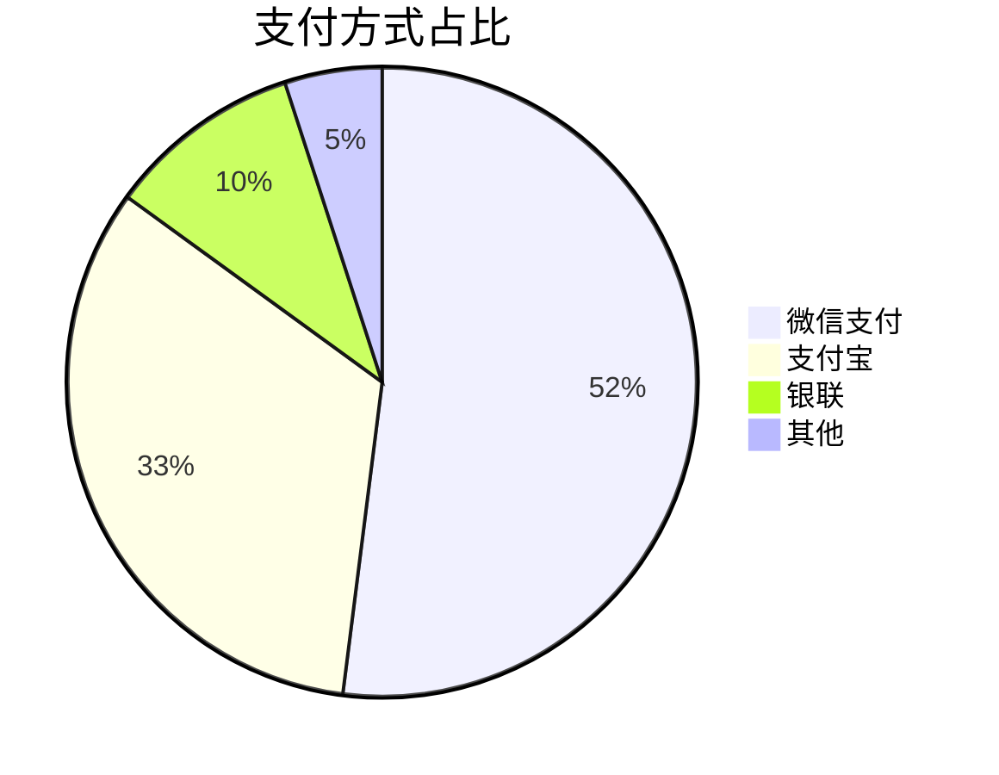
```mermaid
pie
    title 支付方式占比
    "微信支付" : 52
    "支付宝" : 33
    "银联" : 10
    "其他" : 5
```

## 9. 思维导图（mindmap）

### 9a. 多层结构

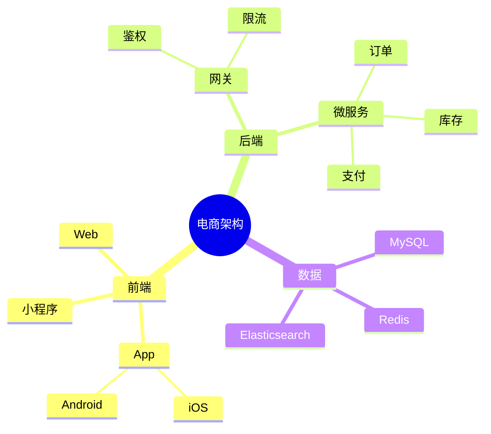
```mermaid
mindmap
  root((电商架构))
    前端
      App
        iOS
        Android
      小程序
      Web
    后端
      网关
        鉴权
        限流
      微服务
        订单
        库存
        支付
    数据
      MySQL
      Redis
      Elasticsearch
```

### 9b. 多种节点形状

```mermaid
mindmap
  root(发布检查清单)
    代码
      [单元测试通过]
      (代码评审完成)
    配置
      [[开关回滚预案]]
      灰度比例确认
    数据
      兼容旧版本
```

## 10. 时间线（timeline）

### 10a. 发展历程

```mermaid
timeline
    title 电商平台发展历程
    section 起步期
        2021 : 上线单体商城 : 支持基础下单
        2022 : 拆分订单与库存服务
    section 成长期
        2023 : 引入微服务网关 : 建立数据仓库
        2024 : 全链路压测常态化 : 开放平台 API
    section 成熟期
        2025 : 多活容灾架构 : 海外仓布局
        2026 : 智能补货与动态定价
```

### 10b. 项目里程碑

```mermaid
timeline
    title 迭代 v2.3 里程碑
    第 1 周 : 需求冻结 : 技术方案评审
    第 2-3 周 : 接口开发 : 前端页面
    第 4 周 : 集成测试 : 性能验证
    第 5 周 : 灰度发布 : 全量上线
```

## 11. Git 提交图（gitGraph）

### 11a. 分支与标签

```mermaid
gitGraph
    commit id: "初始化"
    commit id: "商品模块"
    branch develop
    checkout develop
    commit id: "订单模块"
    commit id: "库存模块"
    checkout main
    merge develop tag: "v1.0.0"
    branch hotfix
    checkout hotfix
    commit id: "修复支付回调" type: REVERSE
    checkout main
    merge hotfix tag: "v1.0.1"
    commit id: "启动 v1.1"
```

### 11b. 多分支并行

```mermaid
gitGraph
    commit id: "基线"
    branch 功能A
    branch 功能B
    checkout 功能A
    commit id: "购物车优化"
    commit id: "结算页优化"
    checkout 功能B
    commit id: "搜索联想"
    checkout main
    merge 功能A
    checkout 功能B
    merge main
    commit id: "搜索排序调整"
    checkout main
    merge 功能B tag: "v2.0.0"
```

## 12. XY 图表（xychart-beta）

### 12a. 柱线组合

```mermaid
xychart-beta
    title "月度销售额（万元）"
    x-axis [1月, 2月, 3月, 4月, 5月, 6月]
    y-axis "销售额" 0 --> 120
    bar [65, 55, 80, 78, 95, 110]
    line [65, 55, 80, 78, 95, 110]
```

### 12b. 双折线对比

```mermaid
xychart-beta
    title "今年 vs 去年订单量（千单）"
    x-axis [Q1, Q2, Q3, Q4]
    y-axis "订单量" 0 --> 100
    line [40, 55, 70, 92]
    line [32, 41, 58, 75]
```

## 13. 象限图（quadrantChart）

### 13a. 需求价值矩阵

```mermaid
quadrantChart
    title 需求价值矩阵
    x-axis 低紧迫性 --> 高紧迫性
    y-axis 低价值 --> 高价值
    quadrant-1 立即安排
    quadrant-2 规划排期
    quadrant-3 择机处理
    quadrant-4 考虑放弃
    库存超卖修复: [0.85, 0.9]
    大促页面性能: [0.7, 0.75]
    深色模式: [0.3, 0.66]
    界面动效美化: [0.2, 0.28]
    老旧浏览器兼容: [0.45, 0.14]
```

### 13b. 竞品定位

```mermaid
quadrantChart
    title 竞品定位分析
    x-axis 偏工具型 --> 偏社区型
    y-axis 大众市场 --> 专业市场
    quadrant-1 专业社区
    quadrant-2 专业工具
    quadrant-3 大众工具
    quadrant-4 大众社区
    本产品: [0.55, 0.6]
    竞品甲: [0.25, 0.8]
    竞品乙: [0.75, 0.35]
    竞品丙: [0.15, 0.2]
```
